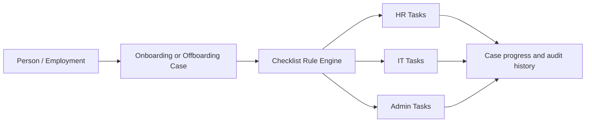

# Team Workbench Phase 2 Architecture

Phase 2 implements **Shared Case + Team-owned Tasks** on top of the Phase 1 Person → Employment → Case lifecycle.

## Data flow

## Checklist templates and rules

- `checklist_templates` is the versioned parent for Onboarding and Offboarding templates.
- `checklist_template_items` stores editable rule items: stable task key, owner team, mandatory flag, applicability arrays, structured due-date reference/offset, default assignee, active state and sort order.
- Authorized HR/System Owners can create, edit, enable or disable templates and add, edit, reorder or disable rules in Settings without changing code.
- Stable rule codes are normalized by `employment_type_code` and `leaving_type_code`; display labels are not compared in UI components.
- `tasks.template_item_id` provides idempotency through a partial unique index on `case_id + template_item_id`.
- Generated Tasks contain a JSON snapshot of name, description, team, mandatory flag and due-date rule. Later template edits do not rewrite completed history.
- `tasks.source` distinguishes `template` from `manual`; synchronization never changes manual Tasks.

## Generation and synchronization

`_sync_case_tasks_internal(case_id, reason)` is the single generation engine used by the Case insert trigger and date/rule-change trigger. The authenticated `sync_case_tasks` wrapper is restricted to HR.

Synchronization:

1. evaluates active rules against current Case values;
2. creates missing applicable Tasks;
3. recalculates due dates for open generated Tasks;
4. preserves completed Tasks and completion metadata;
5. marks no-longer-applicable open generated Tasks `Not Applicable` with audit history;
6. restores only Tasks previously made inapplicable by the engine;
7. leaves manual Tasks untouched.

Due dates use `start_date`, `contract_end_date`, `last_working_day`, or `manual`, plus a signed day offset. An unknown Last Working Day produces a Task with a null due date; entering or changing it resolves open Tasks automatically. Contract End Date is never substituted for an unknown Last Working Day.

## Seed rules

Onboarding contains HR contract/system/pre-registration/employee-ID/email work, IT laptop/account/access work, and Admin desk/badge/facility work.

Offboarding contains standard HR processing/email/reference/LWD/Datalink/leave/overtime work, IT account/access closure, and Admin badge/asset/facility return.

Huawei Employee document matrix:

| Leaving type          | Leaving Agreement | Termination Letter | Garden Leave Letter |
| --------------------- | ----------------: | -----------------: | ------------------: |
| Voluntary resignation |               Yes |                 No |                  No |
| Employer termination  |               Yes |                Yes |                 Yes |

Intern and Leased Labour rules do not generate those three employee-specific documents.

## Ownership, assignment, and permissions

- `user_operational_teams` is the server-authoritative HR / IT / Admin membership model.
- HR can see and manage the full Case and all Tasks, add manual Tasks, synchronize rules, assign work and manage templates.
- IT can read the limited operational context and update/comment only IT Tasks.
- Admin can read the limited operational context and update/comment only Admin Tasks.
- Viewer/Collaborator sharing remains available for read access, but generic collaboration no longer grants broad Task mutation.
- Assignment is separate from owner team. An assignee must belong to the Task's owner team; unassigned Tasks remain visible in the team workload.
- Direct browser update/insert/delete privileges on `tasks` are revoked. Audited security-definer RPCs validate RLS-equivalent team authorization for status, assignment and manual creation.
- `get_operational_case_summary` and `list_operational_tasks` expose only operational Case fields to functional teams, without full Person/HR master data.
- Lifecycle confirmation requires HR authorization. IT/Admin Task membership never grants Confirm Joined or Confirm Left.

## Case sharing and capabilities

Case access and work authorization are separate concepts. A Case member can open the shared Case, but the `Collaborator` label does not imply HR authority. The server-side `get_case_capabilities` RPC is the source of truth for lifecycle, workflow, file, sharing, Task-structure, checklist-rule and full-Case-data capabilities; the Case Detail UI renders actions from those capabilities rather than from the sharing label.

- HR/System Owner Case managers can perform lifecycle and structural Case work.
- IT and Admin members can act only on Tasks owned by their operational team, whether or not the Case was shared with them.
- Viewers have read-only access and cannot update or assign Tasks.
- Operational users receive only the limited operational Case summary. Sharing does not expose unrestricted Person or HR master data.

## Task and Checklist consistency

For every linked pair, `tasks` is authoritative for assignment, status, due date and completion metadata. A database projection trigger mirrors Task changes to its linked Checklist item. Checklist assignment and completion controls call `assign_checklist_owner` and `set_checklist_completion`; those RPCs delegate linked items to the existing audited Task RPCs, so both UI paths enforce the same owner-team rules and produce the same final state. Direct browser updates to Checklist items are revoked.

Legacy Checklist items without a linked Task remain supported as a narrow compatibility path, restricted to authorized HR Case managers. They do not weaken the linked Task authorization model.

## Task state, progress, and activity

Task states include Not Started, In Progress, Waiting, Blocked, Completed and Not Applicable. Completion stores `completed_by` and `completed_at`; Not Applicable requires a reason and stores actor/time.

Case Detail groups Tasks by HR / IT / Admin and shows team progress. Overall progress is based on mandatory applicable Tasks. Mandatory open Tasks prevent Case `Completed`, but never block Phase 1 Confirm Joined/Confirm Left. Joined/Left Cases with open mandatory work remain Follow-up.

Progress uses `Completed applicable Tasks / all applicable Tasks`. `Not Applicable` Tasks are reported separately and excluded from both numerator and denominator. For example, 2 Completed + 1 Not Applicable is 2/2 (100%), and 6 Completed + 2 Not Applicable + 2 Pending is 6/8 (75%). Overall Case progress uses mandatory Tasks; team cards use all Tasks for that team.

My Work provides Assigned to Me, My Team, Due Soon and Completed views. Cards include Person, Case type, owner team, assignment, status and due date context.

Status changes, generation, synchronization, due-date changes, assignment, completion, Not Applicable, comments and Task file metadata are written to `audit_logs`.

## Attachments

`task_files` securely links existing storage objects to Tasks and audits metadata insertion. Phase 2 keeps the data model and RLS in place; a dedicated Task upload control is intentionally deferred because the current Case-file upload pipeline does not yet expose a safe reusable Task storage workflow.

## Backend security closure

- HR Case operations use explicit server capabilities and `can_manage_case`; generic collaboration is not an authorization shortcut.
- Workflow changes, Case files/storage changes, lifecycle date changes, rule synchronization, manual Task creation and sharing are protected by HR Case-manager policies or RPC checks.
- Task mutation remains behind audited security-definer RPCs with operational-team validation.
- Linked Checklist mutation delegates to Task authorization, while structural Checklist changes are HR-only.
- RLS and RPC checks remain authoritative if UI controls are bypassed.

## Closure regression tests

The Phase 2 closure suite verifies that shared IT, Admin and Viewer users do not acquire HR Case permissions; IT/Admin can update only their team Tasks; lifecycle, offboarding-date, workflow, synchronization and manual-Task bypasses fail; Viewer status/assignment attempts fail; assignment through Task and Checklist routes remains identical; wrong-team assignment fails through both routes; Checklist completion/reopen projects back to Task metadata; and direct Checklist updates are denied. Domain tests lock the Not Applicable progress denominator semantics.

## Phase 2 status

Phase 2 is closed when migrations apply cleanly and the complete Phase 1 + Phase 2 + closure test suite, TypeScript check and production build all pass. The Task attachment data model/RLS is present; the dedicated Task upload control remains the documented Phase 2 UI limitation above. No Phase 3 functionality is included.

## Phase 3 boundary

Phase 2 does not include AI agents, Email Center V2, email attachments, Outlook Desktop helpers, People Analytics, advanced charts, or XLSX export improvements.
